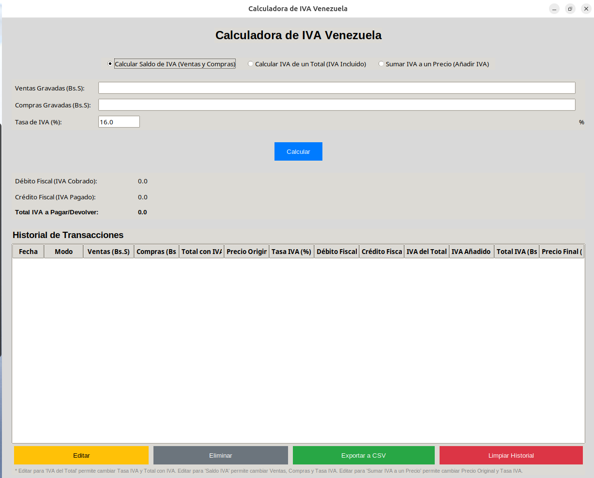

# Calculadora de IVA Avanzada para Venezuela (Python Tkinter)

[](https://www.python.org)
[](LICENSE) 

 

## Descripción General

Esta es una **Calculadora de IVA Avanzada** desarrollada en Python utilizando la librería Tkinter para crear una interfaz gráfica de usuario (GUI).  Está diseñada específicamente para el cálculo del Impuesto al Valor Agregado (IVA) en **Venezuela**, pero puede ser adaptable a otros países ajustando la tasa de IVA.

**Funcionalidades Principales:**

*   **Cálculo Rápido y Preciso de IVA:** Ingresa las ventas y compras gravadas, la tasa de IVA, y obtén al instante el débito fiscal, crédito fiscal y el saldo a pagar o devolver.
*   **Historial de Transacciones Detallado:**  Guarda un registro de cada cálculo realizado, incluyendo fecha, ventas, compras, tasa de IVA utilizada y los resultados.
*   **Edición y Eliminación de Registros del Historial:**  Permite modificar o eliminar registros incorrectos o innecesarios en el historial.
*   **Exportación a CSV:**  Exporta todo el historial de transacciones a un archivo CSV para llevar un registro digital, generar informes o compartir con tu contador.
*   **Interfaz Gráfica Intuitiva y Fácil de Usar:** Desarrollada con Tkinter y `ttkthemes` para una experiencia visual agradable y sencilla.
*   **Multiplataforma (Script Python):**  El código fuente Python puede ejecutarse en **Windows, macOS y Linux** siempre que se tengan las dependencias instaladas.
*   **Ejecutable para Linux (Opcional):** Se proporciona un ejecutable para usuarios de Linux (generado en Ubuntu) para una ejecución aún más sencilla sin necesidad de instalar Python ni dependencias.

## Cómo Utilizar

### Ejecutando el Script Python (`iva_calculator.py`)

Esta es la forma principal de utilizar la calculadora y es **multiplataforma**.

**Requisitos:**

*   **Python 3.x** instalado en tu sistema. Puedes descargarlo desde [https://www.python.org/downloads/](https://www.python.org/downloads/).
*   **Librería `tkinter`:**  Normalmente viene incluida con la instalación de Python (especialmente en Windows y macOS). En Linux, puede que necesites instalarla por separado (ej. `sudo apt install python3-tk` en Ubuntu/Debian).
*   **Librería `ttkthemes`:**  Instala con `pip`:
    ```bash
    pip install ttkthemes
    ```
    (Asegúrate de tener `pip` instalado. Si no, consulta la documentación de Python o tu sistema operativo para instalarlo).

**Pasos para Ejecutar el Script:**

1.  Descarga el archivo `iva_calculator.py` desde este repositorio.
2.  Abre una **Terminal** (en Linux/macOS) o **Línea de Comandos** (en Windows).
3.  Navega hasta la carpeta donde guardaste `iva_calculator.py` usando el comando `cd` (ej. `cd Descargas`).
4.  Ejecuta el script con el comando:
    ```bash
    python iva_calculator.py
    ```
    o (si tienes `python3` como comando principal):
    ```bash
    python3 iva_calculator.py
    ```
5.  La ventana de la Calculadora de IVA se abrirá y podrás empezar a usarla.

### Ejecutando el Ejecutable para Linux (Opcional - `linux/iva_calculator`)

Para usuarios de Linux, se proporciona un ejecutable para simplificar aún más la ejecución.

**Requisitos:**

*   Sistema operativo **Linux** (probado en Ubuntu, pero debería funcionar en otras distribuciones).

**Pasos para Ejecutar el Ejecutable:**

1.  Descarga el archivo `iva_calculator` que se encuentra dentro de la carpeta `linux/` en este repositorio.
2.  Abre una **Terminal** y navega hasta la carpeta donde descargaste el archivo.
3.  Dale permisos de ejecución al archivo con el comando:
    ```bash
    chmod +x iva_calculator
    ```
4.  Ejecuta la calculadora **haciendo doble clic** en el archivo `iva_calculator` en tu gestor de archivos gráfico, o ejecutándola desde la terminal con:
    ```bash
    ./iva_calculator
    ```

**Nota sobre el Ejecutable de Linux:** Este ejecutable fue generado en un entorno Ubuntu.  Aunque debería funcionar en otras distribuciones Linux, puede haber casos de incompatibilidad dependiendo de las librerías del sistema.  Si tienes problemas, te recomiendo usar el script Python (`iva_calculator.py`) que es más flexible y multiplataforma.

### Exportar Historial a CSV

Al hacer clic en el botón "Exportar Historial a CSV", el archivo `historial_iva.csv` se generará **en la misma carpeta donde se encuentra el script Python (`iva_calculator.py`) o el ejecutable (`iva_calculator`)**.

## Personalización (Para Desarrolladores)

Si deseas modificar o contribuir a este proyecto:

*   **Clona este repositorio:** `git clone [URL del repositorio]`
*   **Modifica el código fuente** en `iva_calculator.py`.
*   **Para generar un ejecutable (Linux):**
    1.  Asegúrate de tener `PyInstaller` instalado: `pip install pyinstaller`
    2.  Ejecuta PyInstaller desde la carpeta donde está `iva_calculator.py`:
        ```bash
        pyinstaller --onefile iva_calculator.py
        ```
        El ejecutable se generará en la carpeta `dist/`.  El ejecutable para Linux en este repositorio fue generado con este proceso en Ubuntu.
    *   **Para generar un ejecutable para Windows:**  Deberás realizar el mismo proceso de PyInstaller, pero **desde un sistema operativo Windows** con Python y PyInstaller instalados.

## Licencia

Este proyecto está bajo la licencia **MIT License**. Consulta el archivo [LICENSE](LICENSE) para más detalles.  <!-- Si usas licencia MIT, si no, ajusta -->

## Autor

Desarrollado por **Alexander Carrasquel**

*   [LinkedIn](https://www.linkedin.com/in/alexander-carrasquel-41a616108/)
*   [GitHub](https://github.com/carrasquelalex1) 

**¡Agradecer no cuesta nada!** Si encuentras útil este proyecto, considera dar una estrella ⭐ al repositorio o compartirlo con tu red.  ¡Tu apoyo es importante!

---
¡Espero que esta herramienta te sea de gran utilidad!  Si tienes alguna pregunta, sugerencia o encuentras algún error, por favor, no dudes en crear un "Issue" en este repositorio.
